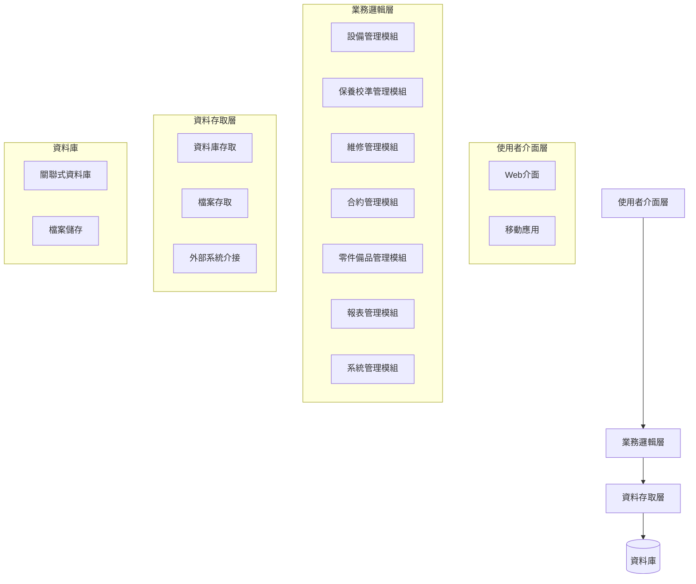

<div style="text-align: center; padding: 50px;">
    <h1 style="font-size: 28px;">博訊設備管理系統</h1>
    <h2 style="font-size: 24px;">系統規格書</h2>
    <br><br><br>
    <p style="font-size: 18px;">版本: 1.0</p>
    <p style="font-size: 18px;">日期: 2024年4月</p>
    <br><br><br><br>
    <p style="font-size: 16px;">博訊科技股份有限公司</p>
</div>

<div style="page-break-after: always;"></div>

# 目錄

1. [系統概述](#1-系統概述)
2. [系統架構](#2-系統架構)
3. [功能規格](#3-功能規格)
   - [3.1 系統選單規劃](#31-系統選單規劃)
   - [3.2 業務流程](#32-業務流程)
     - [3.2.1 保養/校準流程](#321-保養校準流程)
     - [3.2.2 維修流程](#322-維修流程)
4. [資料庫設計](#4-資料庫設計)
   - [4.1 資料庫檔案規劃](#41-資料庫檔案規劃)
   - [4.2 資料庫關聯圖](#42-資料庫關聯圖)
5. [使用者介面設計](#5-使用者介面設計)
6. [系統需求](#6-系統需求)
   - [6.1 功能性需求](#61-功能性需求)
   - [6.2 非功能性需求](#62-非功能性需求)
7. [實施計劃](#7-實施計劃)
   - [7.1 第一階段](#71-第一階段)
   - [7.2 第二階段](#72-第二階段)
8. [附錄](#8-附錄)
   - [8.1 術語表](#81-術語表)
   - [8.2 參考文檔](#82-參考文檔)

<div style="page-break-after: always;"></div>

# 博訊設備管理系統規格書

## 1. 系統概述

本系統旨在提供完整的設備管理解決方案，包含設備資料維護、保養校準排程、維修工單管理、合約管理等功能，以協助企業有效管理設備生命週期，提高設備使用效率，降低維護成本。

## 2. 系統架構

系統採用模組化設計，主要分為以下幾個核心模組：

1. 基礎資料管理
2. 設備管理
3. 保養校準管理
4. 維修管理
5. 合約管理
6. 零件備品管理
7. 報表管理
8. 系統管理

**系統架構圖：**



## 3. 功能規格

### 3.1 系統選單規劃

| 選單名稱 | 需求內容 |
|---------|---------|
| 設備管理 | 維護設備資料，暫定分為3個層級: 設備(儀器)-模組-零件 |
| 供應商管理 | 維護供應商資料，包含負責人的連絡資訊 |
| 客戶管理 | 維護客戶資料，包含旗下的廠區/負責人的連絡資訊 |
| 合約管理 | 維護合約資料，包含合約簽訂者/內容/標的設備/合約期限等等，另外系統需篩選即將到期的合約進行通知 |
| 事件/錯誤代碼管理 | 維護 設備/模組/零件所對應的事件/錯誤代碼，以及相應的SOP流程 |
| 保養/校正作業資料維護 | 維護 保養/校正作業的名稱/標的設備，以及相應的SOP流程 |
| 保養/校正作業排程管理 | 維護 保養/校正的排程作業 包含 相關合約/執行間隔/標的設備/前置作業等資料 |
| 工單管理 | 瀏覽工單的處理情形，除了由系統產生(根據排程產生保養/校正工單，或是根據錯誤代碼的回報生成維修工單)，使用者也可以自行新增工單 |
| 零件備品管理 | 瀏覽博訊/本地經銷商的備品資料 |
| 客製表單流程 | 各項表單流程簽核 |
| 帳號權限管理 | 維護人員資料/設定帳號權限 |
| 報表查詢作業 | 第二階段規劃的內容，產生各類型的表單作為管理人員的參考資料 |

### 3.2 業務流程

#### 3.2.1 保養/校準流程

保養和校準作業是設備管理的重要環節，系統將支援完整的保養校準流程：

1. 系統根據排程自動生成保養/校準工單
2. 通知相關人員執行保養/校準作業
3. 執行人員依照SOP流程執行保養/校準作業
4. 記錄保養/校準結果及相關數據
5. 主管審核保養/校準結果
6. 更新設備保養/校準狀態
7. 生成保養/校準報告

**保養/校準流程圖：**


#### 3.2.2 維修流程

當設備發生故障時，系統將支援以下維修流程：

1. 接收故障報告或系統自動檢測故障
2. 根據錯誤代碼生成維修工單
3. 分派維修工單給相關技術人員
4. 技術人員依照SOP流程執行維修作業
5. 記錄維修過程、使用零件及維修結果
6. 主管審核維修結果
7. 更新設備狀態
8. 生成維修報告

**維修流程圖：**


## 4. 資料庫設計

### 4.1 資料庫檔案規劃

| 主檔名稱 | 備註 |
|---------|------|
| 設備主檔 | 包含設備名稱/類型/所在地等資料，暫定分為3個層級: 設備(儀器)-模組-零件 |
| 供應商主檔 | 博訊本身是供應商，同時也是細胞動力的客戶 |
| 客戶主檔 | 儲存客戶基本資料 |
| 客戶廠區明細檔 | 儲存客戶各廠區資料 |
| 客戶聯絡人明細檔 | 儲存客戶聯絡人資料 |
| 合約主檔 | 儲存合約相關資料 |
| 事件/錯誤代碼主檔 | Ref設備型號/模組名稱/零件類型，紀錄對應的事件/錯誤代碼 |
| 維修SOP流程明細檔 | 事件/錯誤代碼所對應的SOP步驟 |
| 保養/校正主檔 | 紀錄保養/校正的作業名稱/標的設備等相關資訊 |
| 保養/校正流程明細檔 | 保養/校正流程的SOP步驟 |
| 保養/校正排程管理主檔 | 紀錄保養/校正的排程作業，包含執行間隔/相關合約/標的設備等 |
| 工單主檔 | 紀錄工單的名稱/類型/執行者/標的設備/處理內容等資料 |
| 零件備品主檔 | 儲存零件備品資料 |
| 帳號主檔 | 儲存系統使用者帳號資料 |
| 權限主檔 | 儲存系統權限設定 |
| 系統選單主檔 | 儲存系統選單資料 |
| 權限/系統選單關聯檔 | 定義權限與系統選單的對應關係 |
| 帳號/權限關聯檔 | 定義帳號與權限的對應關係 |
| 報表主檔 | 儲存報表設定資料 |

### 4.2 資料庫關聯圖

資料庫關聯將遵循以下主要關係：

- 設備主檔與模組、零件形成階層關係
- 客戶主檔與客戶廠區、聯絡人形成一對多關係
- 合約主檔與客戶主檔、設備主檔形成多對多關係
- 保養/校正排程與設備、合約形成多對多關係
- 工單與設備、執行人員形成多對多關係

**資料庫關聯圖：**


## 5. 使用者介面設計

系統將採用直覺化的使用者介面設計，主要包含以下元素：

1. 主控台：顯示重要通知、待辦事項和關鍵績效指標
2. 導航選單：提供系統各功能模組的快速訪問
3. 資料維護介面：提供各類主檔資料的新增、修改、刪除功能
4. 工單管理介面：提供工單的創建、分派、追蹤和處理功能
5. 報表查詢介面：提供各類報表的生成和查詢功能

**系統主畫面示意圖：**

```
+----------------------------------------------------------+
|                      系統標題欄                           |
+---------------+------------------------------------------+
|               |                                          |
|               |                                          |
|               |                                          |
|   導航選單     |              主要內容區域                  |
|               |                                          |
|               |                                          |
|               |                                          |
+---------------+------------------------------------------+
|                      狀態欄                              |
+----------------------------------------------------------+
```

## 6. 系統需求

### 6.1 功能性需求

1. 設備資料管理
   - 支援設備、模組、零件三層級結構
   - 提供設備基本資料維護功能
   - 支援設備狀態追蹤

2. 保養校準管理
   - 支援保養校準排程設定
   - 自動生成保養校準工單
   - 提供保養校準SOP流程指引

3. 維修管理
   - 支援故障報告處理
   - 提供維修工單管理
   - 支援維修SOP流程指引

4. 合約管理
   - 支援合約資料維護
   - 提供合約到期提醒
   - 支援合約與設備關聯管理

5. 零件備品管理
   - 支援零件備品資料維護
   - 提供零件庫存管理
   - 支援零件使用追蹤

6. 報表管理
   - 提供各類統計報表
   - 支援自定義報表
   - 提供報表匯出功能

7. 系統管理
   - 提供帳號權限管理
   - 支援系統參數設定
   - 提供系統日誌查詢

### 6.2 非功能性需求

1. 效能需求
   - 系統響應時間應在3秒內
   - 支援同時50人以上在線使用

2. 安全需求
   - 提供角色基礎的訪問控制
   - 支援數據加密傳輸
   - 提供操作日誌記錄

3. 可靠性需求
   - 系統可用性應達到99.5%以上
   - 提供數據備份和恢復機制

4. 可擴展性需求
   - 支援未來功能模組擴展
   - 支援用戶數量增長

## 7. 實施計劃

系統實施將分為兩個階段：

### 7.1 第一階段

1. 基礎資料管理模組
2. 設備管理模組
3. 保養校準管理模組
4. 維修管理模組
5. 合約管理模組
6. 零件備品管理模組
7. 系統管理模組

### 7.2 第二階段

1. 報表管理模組
2. 客製表單流程模組
3. 系統優化和功能擴展

**實施時程規劃：**


## 8. 附錄

### 8.1 術語表

- **設備**：指儀器設備整體
- **模組**：設備的組成部分
- **零件**：模組的組成部分
- **SOP**：標準作業程序
- **工單**：工作指令單，包含保養、校準、維修等類型

### 8.2 參考文檔

- 博訊需求初版.xlsx 