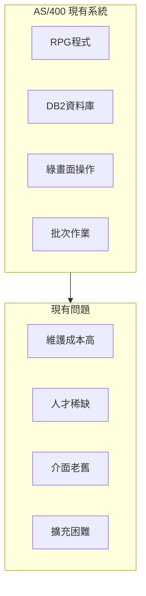
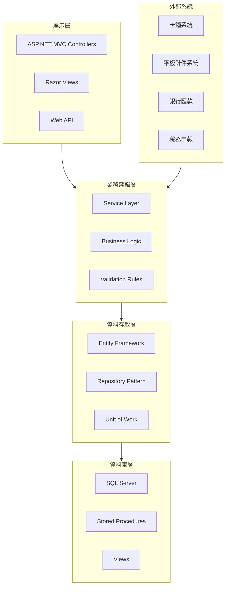
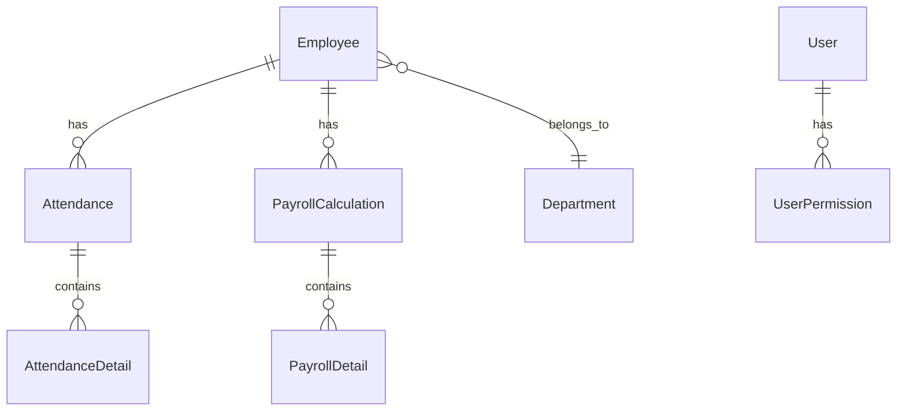
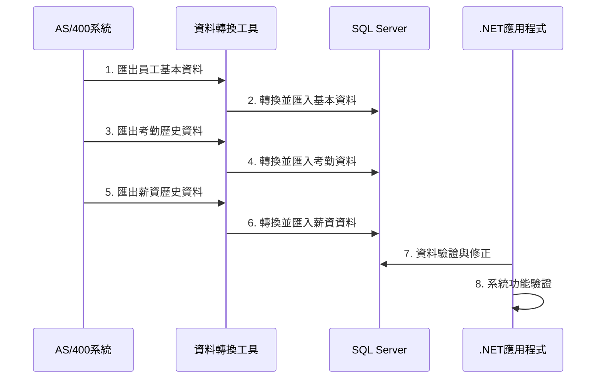

# 年興寧平人事薪資系統 .NET MVC 系統規劃書

> **專案名稱**：年興寧平人事薪資系統現代化改版  
> **目標架構**：ASP.NET MVC + SQL Server  
> **規劃日期**：2025年1月  
> **版本**：v1.0

---

## 📋 目錄

1. [專案概述](#專案概述)
2. [現況分析](#現況分析)
3. [系統架構設計](#系統架構設計)
4. [資料庫設計](#資料庫設計)
5. [功能模組規劃](#功能模組規劃)
6. [權限控制設計](#權限控制設計)
7. [介面設計規範](#介面設計規範)
8. [技術選型](#技術選型)
9. [開發時程規劃](#開發時程規劃)
10. [資料移轉計畫](#資料移轉計畫)
11. [風險評估與對策](#風險評估與對策)

---

## 📊 專案概述

### 專案目標
將現有AS/400平台的人事薪資系統改寫為基於.NET MVC架構的現代化Web應用程式，提升系統效能、維護性及使用者體驗。

### 核心需求
- **權限管理**：HR、會計、勞檢三大角色權限分流
- **考勤管理**：完整的出勤計算與管理功能
- **薪資計算**：支援計件薪與月薪混合計算
- **法規遵循**：符合勞動檢查要求的雙軌報表機制
- **國籍區分**：台籍/外籍員工分別處理

---

## 🔍 現況分析

### AS/400系統現況


### 改版驅動因素
1. **技術債務**：RPG程式維護困難，人才稀缺
2. **使用者體驗**：綠畫面操作不符合現代使用習慣
3. **系統整合**：與其他現代化系統整合困難
4. **法規變化**：需要更靈活的報表產出機制

---

## 🏗️ 系統架構設計

### 整體架構圖


### 技術堆疊
- **前端框架**：ASP.NET MVC 5 + Bootstrap 5 + jQuery
- **後端框架**：.NET Framework 4.8 / .NET 6
- **ORM工具**：Entity Framework Core
- **資料庫**：SQL Server 2019+
- **報表工具**：Crystal Reports / SSRS
- **文件產出**：iTextSharp (PDF)

---

## 🗄️ 資料庫設計

### 核心資料表結構

#### 1. 員工主檔 (Employee)
```sql
CREATE TABLE Employee (
    EmployeeId NVARCHAR(10) PRIMARY KEY,
    Name NVARCHAR(50) NOT NULL,
    Nationality NVARCHAR(2) NOT NULL, -- TW:台籍, FN:外籍
    DepartmentId NVARCHAR(10),
    Position NVARCHAR(50),
    HireDate DATE,
    Status TINYINT, -- 1:在職, 2:離職, 3:留停
    CreatedDate DATETIME2 DEFAULT GETDATE(),
    ModifiedDate DATETIME2,
    INDEX IX_Employee_Nationality (Nationality),
    INDEX IX_Employee_Status (Status)
)
```

#### 2. 權限管理 (UserPermission)
```sql
CREATE TABLE UserPermission (
    UserId NVARCHAR(50),
    ModuleCode NVARCHAR(20), -- HR, ACC, LAB
    FunctionCode NVARCHAR(20), -- CREATE, READ, UPDATE, DELETE
    NationalityScope NVARCHAR(10), -- TW, FN, ALL
    IsActive BIT DEFAULT 1,
    PRIMARY KEY (UserId, ModuleCode, FunctionCode)
)
```

#### 3. 考勤記錄 (Attendance)
```sql
CREATE TABLE Attendance (
    AttendanceId BIGINT IDENTITY PRIMARY KEY,
    EmployeeId NVARCHAR(10) NOT NULL,
    AttendanceDate DATE NOT NULL,
    ClockIn TIME,
    ClockOut TIME,
    WorkHours DECIMAL(4,2),
    OvertimeHours DECIMAL(4,2),
    Status TINYINT, -- 1:正常, 2:遲到, 3:早退, 4:曠職
    CreatedDate DATETIME2 DEFAULT GETDATE(),
    INDEX IX_Attendance_Employee_Date (EmployeeId, AttendanceDate)
)
```

#### 4. 薪資計算 (PayrollCalculation)
```sql
CREATE TABLE PayrollCalculation (
    PayrollId BIGINT IDENTITY PRIMARY KEY,
    EmployeeId NVARCHAR(10) NOT NULL,
    PayrollPeriod NVARCHAR(6), -- YYYYMM
    BaseSalary DECIMAL(10,2),
    PieceworkPay DECIMAL(10,2),
    OvertimePay DECIMAL(10,2),
    Allowances DECIMAL(10,2),
    Deductions DECIMAL(10,2),
    NetPay DECIMAL(10,2),
    LaborInspectionNetPay DECIMAL(10,2), -- 勞檢顯示金額
    IsCalculated BIT DEFAULT 0,
    IsClosed BIT DEFAULT 0,
    CalculatedDate DATETIME2,
    INDEX IX_Payroll_Period (PayrollPeriod),
    INDEX IX_Payroll_Employee (EmployeeId)
)
```

### 資料庫關係圖


---

## ⚙️ 功能模組規劃

### 1. 權限管理模組 (AuthenticationModule)

#### 主要功能
- 使用者登入驗證
- 角色權限控制
- 國籍別權限管控
- 功能權限細分控制

#### 核心類別
```csharp
public class AuthenticationService
{
    Task<LoginResult> LoginAsync(string username, string password);
    Task<bool> HasPermissionAsync(string userId, string module, string function, string nationality);
    Task<UserPermissions> GetUserPermissionsAsync(string userId);
}

public class UserPermissions
{
    public List<string> Modules { get; set; }
    public List<string> Functions { get; set; }
    public List<string> NationalityScopes { get; set; }
    public bool IsLaborInspector { get; set; }
}
```

### 2. HR考勤管理模組 (AttendanceModule)

#### 主要功能
- 員工基本資料維護
- 出勤基本資料設定
- 卡鐘資料匯入處理
- 請假加班異常處理
- 考勤月結計算
- 考勤報表產出

#### 核心類別
```csharp
public class AttendanceService
{
    Task ImportClockDataAsync(List<ClockRecord> records);
    Task<AttendanceCalculationResult> CalculateMonthlyAttendanceAsync(string period, string nationality);
    Task<bool> CloseAttendancePeriodAsync(string period);
    Task<AttendanceReport> GenerateAttendanceReportAsync(string period, bool isLaborInspection);
}
```

### 3. 會計薪資管理模組 (PayrollModule)

#### 主要功能
- 計件薪資料匯入與計算
- 薪資項目維護
- 薪資月結計算
- 離職清算處理
- 薪資單產出
- 稅務銀行資料匯出

#### 核心類別
```csharp
public class PayrollService
{
    Task<PieceworkCalculationResult> CalculatePieceworkAsync(string period);
    Task<PayrollCalculationResult> CalculateMonthlyPayrollAsync(string period, string nationality);
    Task<SeveranceCalculationResult> CalculateSeveranceAsync(string employeeId, DateTime resignationDate);
    Task<PayslipResult> GeneratePayslipAsync(string employeeId, string period);
}
```

### 4. 報表產出模組 (ReportModule)

#### 主要功能
- 標準報表產出
- 勞檢報表產出
- Excel匯出功能
- PDF文件產生

#### 核心類別
```csharp
public class ReportService
{
    Task<ReportResult> GenerateStandardReportAsync(ReportRequest request);
    Task<ReportResult> GenerateLaborInspectionReportAsync(ReportRequest request);
    Task<byte[]> ExportToExcelAsync(ReportData data);
    Task<byte[]> GeneratePdfAsync(ReportData data);
}
```

---

## 🔐 權限控制設計

### 權限矩陣
| 功能模組 | HR人員 | 會計人員 | 勞檢帳號 |
|---------|--------|----------|----------|
| 員工基本資料 | 維護 | 新增 | 查詢 |
| 考勤輸入 | 完整權限 | 無權限 | 查詢 |
| 考勤計算 | 完整權限 | 無權限 | 查詢 |
| 薪資輸入 | 無權限 | 完整權限 | 查詢 |
| 薪資計算 | 無權限 | 完整權限 | 查詢 |
| 離職清算 | 無權限 | 完整權限 | 查詢 |
| 報表查詢 | 考勤相關 | 薪資相關 | 勞檢版本 |

### 權限控制實作
```csharp
[AttributeUsage(AttributeTargets.Method | AttributeTargets.Class)]
public class PermissionRequiredAttribute : ActionFilterAttribute
{
    public string Module { get; set; }
    public string Function { get; set; }
    public string Nationality { get; set; }

    public override void OnActionExecuting(ActionExecutingContext context)
    {
        var authService = context.HttpContext.RequestServices
            .GetService<IAuthenticationService>();
        
        var userId = context.HttpContext.User.Identity.Name;
        var hasPermission = authService
            .HasPermissionAsync(userId, Module, Function, Nationality).Result;
            
        if (!hasPermission)
        {
            context.Result = new ForbidResult();
        }
    }
}
```

---

## 🎨 介面設計規範

### 設計原則
1. **響應式設計**：支援桌面、平板、手機多種裝置
2. **直覺操作**：符合現代Web應用使用習慣
3. **資訊清晰**：重要資訊突出顯示
4. **操作確認**：重要操作需要確認機制

### 主要畫面規劃

#### 1. 登入頁面
- 簡潔的登入表單
- 記住帳號功能
- 密碼強度提示

#### 2. 主控台
```
┌─────────────────────────────────────┐
│ 年興寧平人事薪資系統                  │
├─────────────────────────────────────┤
│ [HR考勤] [會計薪資] [報表查詢] [系統管理] │
├─────────────────────────────────────┤
│                                     │
│    待處理事項                        │
│    ■ 2025/01 考勤資料待確認           │
│    ■ 2025/01 計件薪待計算             │
│                                     │
│    快速功能                          │
│    [匯入卡鐘] [薪資計算] [產出報表]    │
│                                     │
└─────────────────────────────────────┘
```

#### 3. 資料維護畫面
- 清楚的表單欄位標示
- 即時驗證提示
- 批次操作功能

---

## 🛠️ 技術選型

### 開發框架
```yaml
前端技術:
  - ASP.NET MVC 5
  - Bootstrap 5.x
  - jQuery 3.x
  - Chart.js (圖表)
  
後端技術:
  - .NET Framework 4.8 或 .NET 6
  - Entity Framework Core 6.x
  - AutoMapper (物件映射)
  - FluentValidation (驗證)
  
資料庫:
  - SQL Server 2019+
  - Redis (快取)
  
報表工具:
  - SSRS 或 Crystal Reports
  - iTextSharp (PDF產生)
  - EPPlus (Excel產生)
```

### 架構模式
- **MVC模式**：Model-View-Controller分離
- **Repository模式**：資料存取層抽象化
- **Service層**：業務邏輯封裝
- **依賴注入**：提高程式碼可測試性

---

## 📅 開發時程規劃

### 階段一：基礎建設 (4週)
- [ ] 專案架構建立
- [ ] 資料庫設計與建立
- [ ] 基礎框架設定
- [ ] 權限系統開發

### 階段二：核心功能 (8週)
- [ ] 員工基本資料管理
- [ ] 考勤管理功能
- [ ] 計件薪管理功能
- [ ] 薪資計算功能

### 階段三：進階功能 (6週)
- [ ] 報表系統開發
- [ ] 離職清算功能
- [ ] Excel/PDF匯出功能
- [ ] 勞檢報表機制

### 階段四：測試與上線 (4週)
- [ ] 系統整合測試
- [ ] 使用者驗收測試
- [ ] 資料移轉執行
- [ ] 正式上線部署

**總計：22週 (約5.5個月)**

---

## 🔄 資料移轉計畫

### 移轉策略
1. **分階段移轉**：先移轉基本資料，再移轉交易資料
2. **雙軌運行**：新舊系統並行運作一段時間
3. **資料驗證**：確保移轉資料完整性與正確性

### 移轉步驟


### 資料對應表
| AS/400檔案 | SQL Server資料表 | 說明 |
|-----------|-----------------|------|
| EMPLOYEE | Employee | 員工主檔 |
| ATTEND | Attendance | 考勤記錄 |
| PAYROLL | PayrollCalculation | 薪資計算 |
| USERAUTH | UserPermission | 使用者權限 |

---

## ⚠️ 風險評估與對策

### 技術風險
| 風險項目 | 風險等級 | 影響 | 對策 |
|---------|---------|------|------|
| 資料移轉失敗 | 高 | 系統無法上線 | 建立完整備份與回復機制 |
| 效能問題 | 中 | 使用者體驗差 | 進行效能測試與優化 |
| 整合困難 | 中 | 外部系統無法連接 | 提前進行整合測試 |

### 業務風險
| 風險項目 | 風險等級 | 影響 | 對策 |
|---------|---------|------|------|
| 使用者接受度低 | 中 | 系統推廣困難 | 加強教育訓練與使用者參與 |
| 法規變更 | 低 | 系統需要調整 | 設計彈性架構便於調整 |
| 關鍵人員異動 | 中 | 專案延遲 | 建立知識文件與備援人力 |

### 風險應對策略
1. **定期風險評估**：每週進行風險狀況檢討
2. **應變計畫**：針對高風險項目制定應變措施
3. **溝通機制**：建立順暢的問題回報與處理流程

---

## 📈 預期效益

### 量化效益
- **維護成本降低**：預估減少40%的系統維護成本
- **作業效率提升**：報表產出時間縮短60%
- **錯誤率降低**：自動化計算減少人為錯誤50%

### 質化效益
- **使用者體驗改善**：現代化介面提升操作便利性
- **系統擴充性**：便於未來功能擴充與整合
- **技術債務清理**：解決舊系統維護困難問題
- **法規遵循**：更靈活的報表機制符合法規要求

---

## 📝 結論

本規劃書提供了將AS/400人事薪資系統改寫為.NET MVC架構的完整藍圖。透過現代化的技術架構、完善的權限控制、直覺的使用者介面，以及嚴謹的開發流程，可以有效提升系統的效能、維護性與使用者體驗。

建議按照本規劃書的時程與步驟，逐步推動系統現代化專案，確保專案成功並達到預期效益。

---

*本文件將隨專案進行持續更新與修正*
