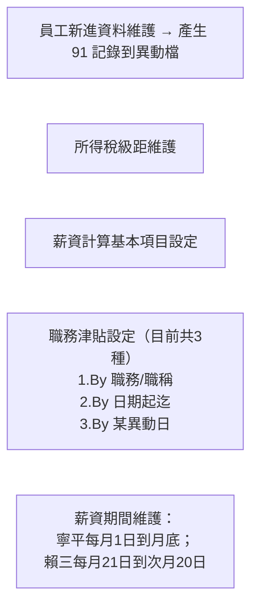
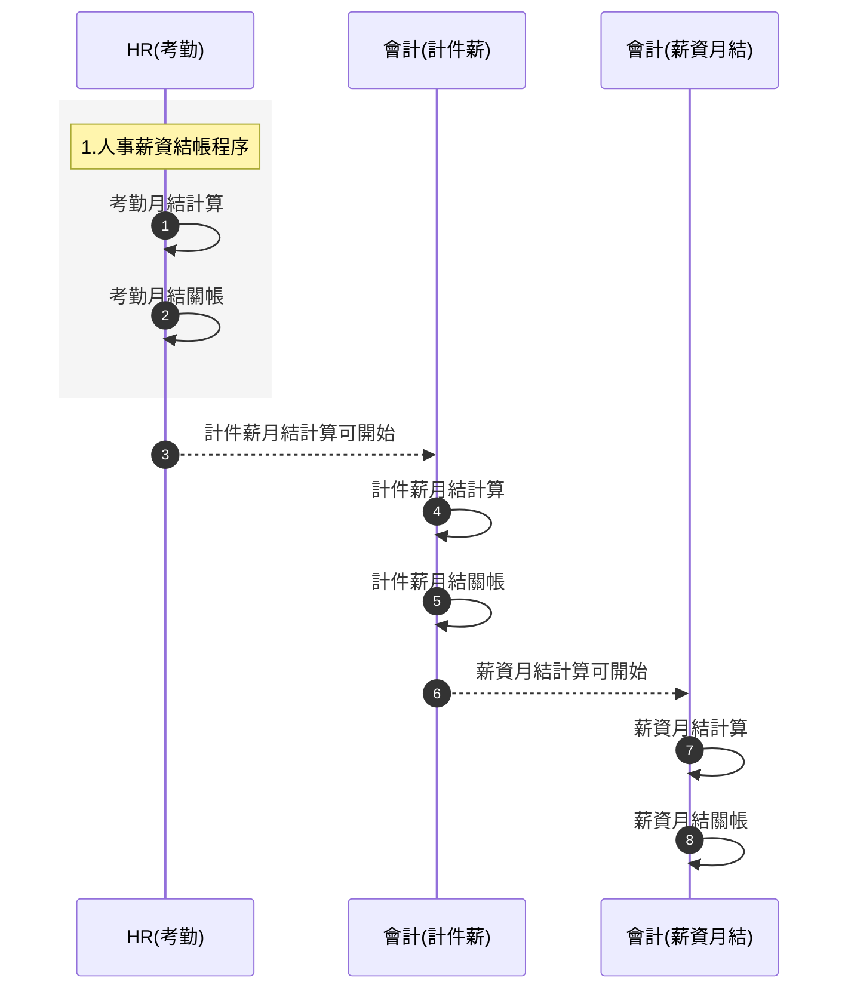

# 年興寧平人事薪資系統作業流程（PDF 對照版／分頁）

> 來源：年興寧平人事薪資系統作業流程(20250813).pdf  
> 說明：以下各「分頁」對應 PDF 主要區塊，內容按原文節點與說明重製，便於逐段審閱與貼到內部文件。

---

## 分頁 1｜系統登入與權限分流
```mermaid
flowchart TD
  A([系統啟動]) --> B[用戶登入驗證<br/>USER以帳號登入系統]
  B --> C{{權限角色判斷}}

  subgraph HR[HR人員]
    HR_note[[
(1)HR人員只能做有國籍權限的考勤輸入、考勤計算、考勤查詢，<br/>不可執行薪資計算、薪資查詢。<br/>
*例如做外籍員工考勤計算的HR，若沒有執行台籍考勤權限的話，無法查詢台籍員工考勤資料。
]]
  end

  subgraph ACC[會計人員]
    ACC_note[[
(2)會計人員只能做有國籍權限的薪資異動輸入、薪資計算、離職清算、薪資查詢。<br/>
無此國籍權限的會計人員無法執行薪資計算與查詢。<br/>
*例如做外籍員工薪資計算的會計，若沒有執行台籍薪資權限的話，無法執行台籍員工薪資計算與查詢。
]]
  end

  subgraph LAB[勞動檢查]
    LAB_note[[
(3)勞動檢查所使用的帳號，只能查詢符合勞動局規定產出的相關出勤與薪資資料。<br/>
勞動檢查時登入帳號：只有查詢列印功能。
]]
  end

  C -->|HR| HR
  C -->|會計| ACC
  C -->|勞檢| LAB

  U0[[
1.主要分 HR、會計、勞動檢查三類權限（前端USER沒有系統請假、加班輸入 & 考勤薪資查詢功能）
]] --> B

  U1[[
2.權限要可區分：<br/>
(1)可使用哪些程式 & 哪些功能（是否可新增、修改、刪除、查詢、確認..）<br/>
(2)可執行哪些國籍的資料輸入、薪資計算、考勤計算、查詢<br/>
(3)是否顯示勞動檢查資料
]] --> C
```

---

## 分頁 2｜HR：考勤流程與維護
```mermaid
flowchart LR
  subgraph 基本維護
    H1[員工基本資料維護]
    H2[假別、班別等出勤基本資料維護]
    H3[全廠行事曆維護<br/>(設定工作日、例假日、國假設定)]
    H4[排班設定維護<br/>(依員工班別產生每人上下班時間)]
    H5[政府規定加班限制<br/>每日加班時數限制 W<br/>每週加班時數限制 X<br/>每月班時數限制 Y]
  end

  subgraph 考勤輸入
    H6[每日卡鐘資料匯入]
    H7[請假/加班/異常刷卡補登輸入<br/>(卡資料補登等處理)]
    H8[員工調任資料維護<br/>(平行調動，薪資不變)→ 產生 93 記錄到異動檔]
    H9[員工離職輸入 → 產生 99 記錄到異動檔]
    H10[員工棄職輸入 → 產生 98 記錄到異動檔]
    H11[員工棄職取消輸入 → 產生 96 記錄到異動檔]
  end

  subgraph 離職清算
    L1[離職清算計算，包含：<br/>1.未計算的薪資（包含計件薪 & 月薪）<br/> → 計算單一員工薪資：若一日離職，則要於離職當日計算出上月薪資（離職日不計薪）<br/>*同樣須將符合勞動檢查的薪資記錄存檔<br/>2.離職金]
  end

  subgraph 月結與報表
    C0{{考勤月結計算就緒?}}
    C1[考勤月結計算]
    R1[報表/查詢：<br/>(1)刷卡明細表 & 轉 EXCEL<br/>(2)相關出勤查詢 & 報表]
    C2{{考勤月結關帳?}}
    C3[考勤月結關帳完成]
    C4{{是否取消考勤月結關帳?}}
    C5[考勤月結關帳取消 → 考勤月結重新計算]
  end

  H1 --> H2 --> H3 --> H4 --> H5 --> H6 --> H7
  H7 --> H8 --> H9 --> H10 --> H11 --> C0
  C0 -->|是| C1 --> R1 --> C2
  C2 -->|是| C3 --> C4
  C4 -->|是| C5 --> C1
  C0 -->|否| H7
  C2 -->|否| R1

  note right of R1
    出勤計算後的報表都必須可另出顯示「符合勞動檢查」的出勤表；<br/>
    *以USER帳號區分印哪種表；<br/>
    *超過加班規定的刷卡紀錄，在印表時須以符合規定的時數顯示；<br/>
    考勤實際紀錄不變。<br/><br/>
    僅具有此國籍考勤使用權限的HR帳號，才可操作：輸入、計算、查詢此國籍員工的考勤資料；<br/>
    沒有開放一般員工查詢。
  end
```

---

## 分頁 3｜會計：計件薪（含其他維護）
```mermaid
flowchart LR
  P0[每日平板所輸入的計件產量匯入]
  P1[計件薪單價維護（以貨號+工段維護計件薪）]
  P2[計件薪計算]
  P3{{檢核資料}}
  P4{{計件薪月結關帳?}}
  P5[計件薪月結關帳完成]
  P6{{是否取消計件薪月結關帳?}}
  P7[計件薪月結關帳取消 → 計件薪月結重新計算]

  P1 --> P0 --> P2 --> P3 --> P4
  P4 -->|是| P5 --> P6
  P6 -->|是| P7 --> P2
  P4 -->|否| P3

  note right of P5
    計件薪關帳完成，才能做「薪資月結計算」。
  end
```

**會計端其他維護**


---

## 分頁 4｜會計：薪資月結與產出
```mermaid
flowchart TB
  S0{{計件薪關帳完成?}}
  S1[薪資月結計算（依國籍分別月結計算；依照請假假別、加班時數等資料、計件薪等資料計算）]
  S2{{檢核資料 → 做薪資月結關帳?}}
  S3[薪資月結關帳完成]
  S4{{是否取消薪資月結關帳?}}
  S5[薪資月結關帳取消 → 薪資月結重新計算]

  S0 -->|是| S1 --> S2
  S2 -->|是| S3 --> S4
  S4 -->|是| S5 --> S1
  S2 -->|否| S1

  subgraph 產出
    O1[員工薪資單與 PDF 檔]
    O2[全廠各部門別薪資清冊（依照薪資年度）]
    O3[稅務申報資料轉 EXCEL 檔]
    O4[銀行匯款資料轉 EXCEL 檔]
    O5[薪資相關管理報表與查詢]
  end
  S3 --> O1 & O2 & O3 & O4 & O5

  note right of S3
    *薪資月結關帳後：薪資資料不可再修改；不可再做薪資月結計算。
  end

  note right of O5
    薪資月結計算後的報表都必須可另出顯示「符合勞動檢查」的薪資報表；<br/>
    *以USER帳號區分印哪種表；<br/>
    *超過加班規定的刷卡紀錄，在印表時須以符合規定的時數顯示；<br/>
    勞動檢查的薪資單上：加班時數必須符合限制時數、加班費必須符合限制時數算出的金額；<br/>
    *勞動檢查僅報表顯示修改，實際薪資紀錄不變；<br/>
    *稅務申報以「實際薪資」申報。<br/><br/>
    1) 僅具有此國籍薪資使用權限的會計帳號，才可操作：輸入、計算、查詢此國籍員工的薪資資料；<br/>
    2) 申報稅務都是轉出 EXCEL 檔和報表；<br/>
    3) 薪資發放若有銀行匯款部分，也是轉出 EXCEL 檔後給銀行處理；<br/>
    4) 薪資傳票沒有寫回 ERP，由會計在集團總帳以人工分錄入帳。
  end
```

---

## 分頁 5｜結帳程序與重算程序


**對應重算步驟**
- 考勤重算：薪資月結關帳取消 → 計件薪月結關帳取消 → 考勤月結關帳取消 → 考勤月結重新計算。
- 計件薪重算：薪資月結關帳取消 → 計件薪月結關帳取消 → 計件薪月結重新計算。
- 薪資月結重算：薪資月結關帳取消 → 薪資月結重新計算。

